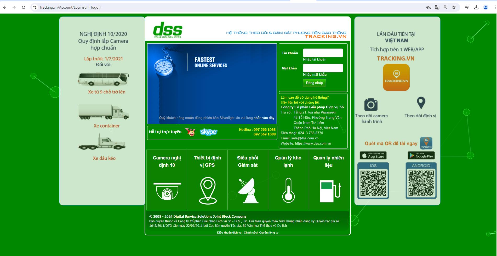
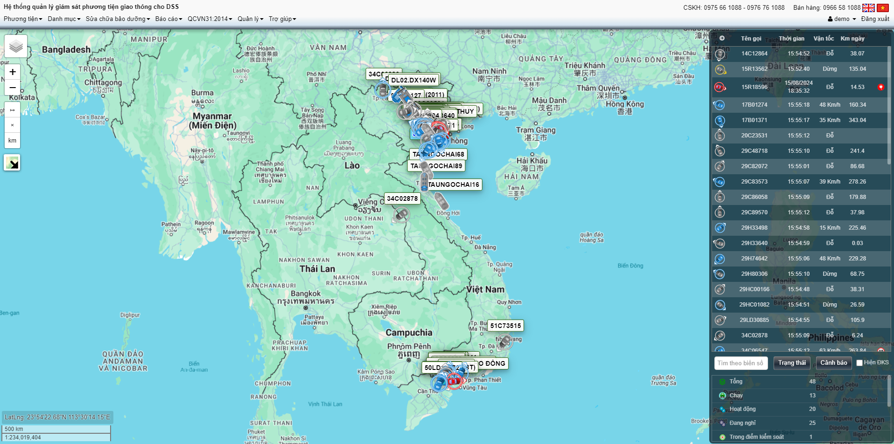
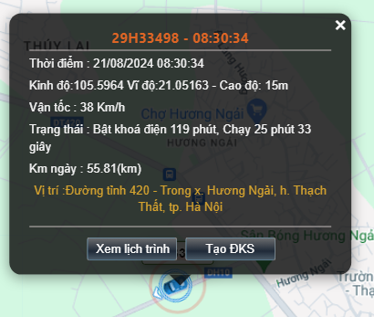

# Đăng nhập hệ thống
Để bắt đầu sử dụng phần mềm, người dùng cần đăng nhập vào hệ thống phần mềm quản lý vận tải theo đường link [Tracking.vn](https://tracking.vn/). Đăng nhập bằng tài khoản và mật khẩu được cung cấp.

# Giao diện trang chủ
(*Sau khi đăng nhập bằng tài khoản và mật khẩu cung cấp, màn hình trang chủ hiển thị như sau):

## 1. Các thanh công cụ
## 2. Xem thông tin xe trực tuyến
### 2.1 Thông tin xe trực tuyến
### 2.2 Xem lại lộ trình di chuyển
